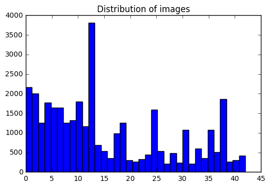

## German sign classification using deep learning
### Preet Singh
This repository contains my work on Udacity’s Traffic Sign recognition project in their Self-Driving Car program, which was based the German Traffic Sign Recognition Benchmark classification competition held at IJCNN 2011. 
The python notebook contains the code to train a convolutional neural net pipeline that identifies german traffic signs with a test accuracy of 96.1%.

**Tools I used:** Python 3, TensorFlow, OpenCV

### Getting started 
Download the data here. Instructions and code for extracting the data and training the network are given in the notebook. The rest of this README provides a summary of the model:

### I. Data Set Summary & Exploration

Number of training examples = 34799  
Number of testing examples = 12630  
Image data shape = (32, 32, 3)  
Number of classes = 43  

#### Exploratory analysis:
Code in this section selected an image at random, displayed it along with it’s label as well as numerical bounds. The image are RGB images - 32 x 32 x 3 matrices containing values in the range 0-255. I’ve scaled them in the range of -1 to +1 (you might prefer -0.5 to +0.5). This naturally lends itself to a tanh activation, but I’ve achieved excellent results from ReLus. I’ve also used histogram equalization on the images, specifically a CLAHE implementation. 

#### Basic frequency analysis of the dataset wrt labels:

 

As you can see, the dataset is not balanced across the labels. In other words, we don't have the same number of images for each sign. This could be a good thing, since perhaps it's showing more frequently occurring road signs, more frequently. However, if future test sets have a markedly differently distribution from our training test, that could work against us. Imbalance in the training set causes bias towards labels that have more data. I’ve left the imbalance in, since I want my classifier to select the more frequently occurring road sign when deciding between possibilities. 

### II. Model Architecture

### III. Modifications to my model and dataset
An excellent starting point to the problem is Traffic sign recognition with multi-scale Convolutional Networks by Sermanet and LeCun (IJCNN 2011). My model is a modified version of the one presented in the paper. Convolutional Neural Nets work well on image recognition because they break up complex images into simpler features. Convolutions or filters enable the model to have a different definition of features at every layer: One convolutional layer might deal with simple lines and curves, another might deal with sub-shapes and so on. 

#### Data augmentation
The dataset is fairly small to begin with - at only 40,000 data points, initial training data is markedly smaller than the number of parameters of my model which clearly shows on initial runs: 
Early iterations had 80% validation accuracy and 90%+ training accuracy. The gap clearly indicates that the original training data is small enough for the model to simply memorize it without really learning anything. To correct for this, I’ve augmented the data by perturbing the images in three different ways, and created five new images from each original one. My augmented dataset is 208,794 data points.  

#### Hyperparameters 
I’ve chosen an Epoch length of 50, a batch size of 128 and a learning rate of 0.0005, but feel free to play around with these values. I also use an Adam optimizer instead of say, Stochastic Gradient Descent. 

#### Additional modifications
 I’ve also added dropout layers to my CNN with a keep-drop probability of 0.8 to reduce overfitting. A quick explanation of the way dropout works is activations are randomly chosen to be ignored or dropped out. The NN can no longer depend on any one activation in the net, so it must learn redundant representations of everything: It reduces overfitting since every representation requires more 'votes'. 

### IV. Performance & troubleshooting

The model achieves 96.1% (test) accuracy but you can probably improve this with a deeper network (at the cost of higher training times and a worse training-data-to-model-parameters ratio), say, by adding 1x1 convolutional layers.  The notebook also shows further testing on  somewhat arbitrary images of German road signs I’ve downloaded from the internet. I’ve chosen a numerical sign to see if my model can read digits accurately (60 kmh vs say, 80 kmh),  and 2 sets of images have been chosen because they’re close enough to be confused for each other,  such as the two passing signs, or the two signs that show white arrows on a blue background. 
 If you output softmax scores when troubleshooting as I’ve done in the last section, you can obtain a better idea of how the classifier is doing. This way your metric is based not only on say, how many images the model misclassifies, but also how much confidence the images are misclassified with. 

